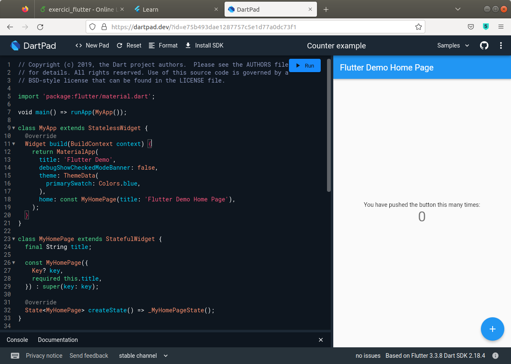
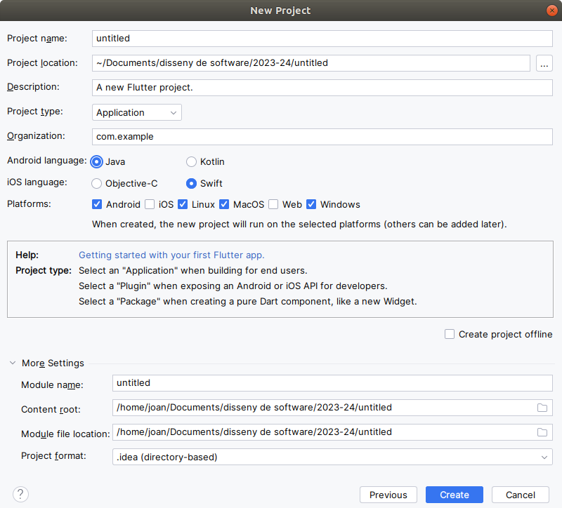
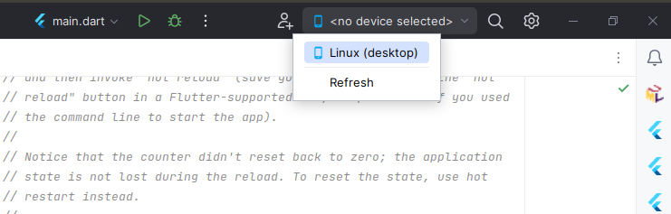
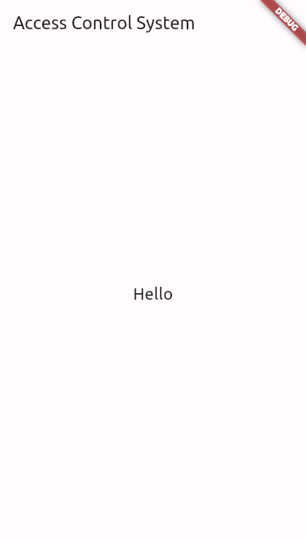
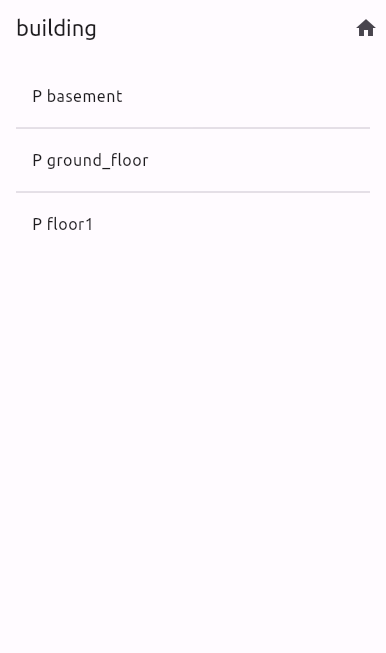
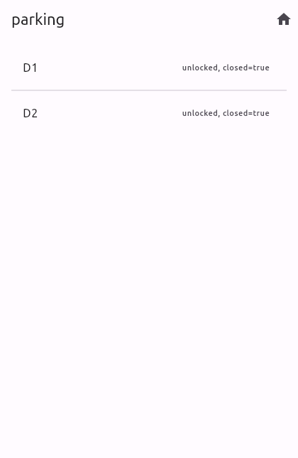

Tutorial App Access Control System
===

This tutorial has three goals:
- learn how to make a simple user interface in Flutter
- build the code base of the client app that you have to do in the third milestone of the practicum
- make the starting point for a flutter exercise

Code base means that some parts of the code you'll probably want to keep them, but others related to the user interface appearance, will definitely be changed.

This is what we are going to build:


<br>

What this animation shows is :
- two types of screens, one for partitions and spaces, another for the doors giving access to an space
- navigation down and up the hierarchy of partitions, spaces and doors of the building in the simulator
- send refresh, area and door requests to the server, and udpdate the data presented in the interface

Preconditions:
- you have installed Flutter into IntelliJ. If not, see how to in the practicum handout. Or see section [Environment](#environment) below.
- you have read the slides on Dart and Flutter, including Flutter "futures"
- optionally you have also gone through the getting started codelab in [flutter.dev](http://flutter.dev)

<br>


# 1. Environment <a id="environment"></a>

Installing Flutter plus everything needed to develop for Android (the Android virtual devices, the Android SDK, set up your mobile phone in order to run the app in it or the Android emulator etc.) takes time. You will eventually do it in the third milestone but now there are two shortcuts to do this tutorial and to start the exercise right away. 
1. Simplest, no installation required whatsoever : go to <a href="https://dartpad.dev">https://dartpad.dev</a>, make a new pad of Flutter type, copy-paste the code below to the "pad" and click button Run whenever you want to execute it. The only difference is that all the code goes to the same "file", not to different files like in IntelliJ, and consequently you need to not repeat some import sentences.
<br>
<br>


2. Use IntelliJ but defer execution on your mobile or the emulator and instead set as application target your Linux or Windows desktop. Select File $\rightarrow$ New  $\rightarrow$ Project  $\rightarrow$ Flutter and configuration
<br>
<br>

<br>
<br>
Then 


<br>


# 2. First two screens

First step is to create Dart classes to represent partitions, spaces and doors. These classes won't have methods but just hold data to be displayed in the user interface. Hence, we won't be able to order any action yet.

In a mobile screen it is infeasible to show the whole hierarchy, so we will show at each moment the children of a certain node: the child partitions and spaces of a father partition, or the doors of an space. The name of the father node will be displayed as the title of the screen.

Since the data to show is different for areas and doors, there will be two different screens, views in Flutter terms, one for each type. 

For the moment we will instantiate a fixed tree in Dart, that of the simulator building. In this way we defer the connection to the ACU webserver to a later stage and start simple. Later on, we will discard this tree and the data shown will be the answer to a REST query to the ACU webserver, a ``get_children`` request.


## 2.1 Create the data to show

Launch IntelliJ and create a new Flutter project named `tutorial_acs`. Let the wizard create the `lib/main.dart` file for you. Add a new Dart file to the lib folder named `tree.dart` with the following content:


```dart
abstract class Area{
  late String id;
  late List<dynamic> children;
  Area(this.id, this.children);
}

class Partition extends Area {
  Partition(String id, List<Area>children) : super(id, children);
}

class Space extends Area {
  Space(String id, List<Door> children) : super(id, children);
}

class Door {
  late String id;
  late bool closed;
  late String state;
  Door({required this.id, this.state="unlocked", this.closed=true});
}

// at the moment this class seems unnecessary but later we will extend it
class Tree {
  late Area root;

  Tree(this.root);
}

Tree getTree(String id) {
  final List<Door> doors = List<Door>.of([
    Door(id:"D1"), Door(id:"D2"), Door(id:"D3"), Door(id:"D4"), Door(id:"D5"),
    Door(id:"D6"), Door(id:"D7"), Door(id:"D8"), Door(id:"D9")
  ]);

  Map<String, Area> areas = {};
  areas["parking"] = Space("parking", List<Door>.of([doors[0], doors[1]]));
  areas["room1"] = Space("room1", List<Door>.of([doors[4]]));
  areas["room2"] = Space("room2", List<Door>.of([doors[5]]));
  areas["hall"] = Space("hall", List<Door>.of([doors[2], doors[3]]));
  areas["room3"] = Space("room3", List<Door>.of([doors[7]]));
  areas["it"] = Space("it", List<Door>.of([doors[8]]));
  areas["corridor"] = Space("corridor", List<Door>.of([doors[6]]));
  areas["basement"] = Partition("basement", List<Area>.of([areas["parking"]!]));
  areas["ground_floor"] = Partition("ground_floor",
      List<Area>.of([areas["room1"]!, areas["room2"]!, areas["hall"]!
      ]));
  areas["floor1"] = Partition("floor1",
      List<Area>.of([areas["room3"]!, areas["it"]!, areas["corridor"]!
      ]));
  areas["building"] = Partition("building",
      List<Area>.of([areas["basement"]!, areas["ground_floor"]!, areas["floor1"]!
      ]));

  return Tree(areas[id]!);
}

testGetTree() {
  Tree tree;

  for (String id in ["building", "hall", "floor1", "room1"]) {
    tree = getTree(id);
    if (tree.root is Partition) {
      print("root ${tree.root.id}");
      for (Area area in tree.root.children) {
        print("child ${area.id}");
      }
    } else {
      print("root ${tree.root.id}");
      for (Door door in tree.root.children) {
        print("child ${door.id}, state ${door.state}, closed ${door.closed}");
      }
    }
    print("");
  }
}

void main() {
  testGetTree();
}
```

Read the code, it's simple: two classes ``Partition`` and ``Space`` inherit from ``Area``. In function ``getTree()`` we instantiate a dictionary whose keys are area ids and the value the subtree that has that area as root node.

Declaring an attribute as ``late`` means we are not giving it a value right now, but it will be assigned a non-null value in the constructor. The ``!`` means we are going to check during execution that the value of a variable or expression is not null, and if it is, launch an exception.

To run this test in IntelliJ, run Current file, or make a new run configuration. In https://dartpad.dev simply copy-paste the code to a new Flutter pad and click on the Run button. You'll see the following output

```text
root building
child basement
child ground_floor
child floor1

root hall
child D3, state unlocked, closed true
child D4, state unlocked, closed true

root floor1
child room3
child it
child corridor

root room1
child D5, state unlocked, closed true
```

<br>

## 2.2 Create a screen to show areas

**1.** In IntelliJ, open file `main.dart` and replace its content by this.

```dart
import 'package:flutter/material.dart';

void main() {
  runApp(const MyApp());
}

class MyApp extends StatelessWidget {
  const MyApp({super.key});

  // This widget is the root of your application.
  @override
  Widget build(BuildContext context) {
    return MaterialApp(
      title: 'ACS',
      theme: ThemeData(
        colorScheme: ColorScheme.fromSeed(seedColor: Colors.deepPurple),
        useMaterial3: true,
        textTheme: const TextTheme(
          bodyMedium: TextStyle(fontSize: 20), // size of hello
        ),
        // see https://docs.flutter.dev/cookbook/design/themes
      ),
      home: Scaffold(
        appBar: AppBar(
          title: const Text('Access Control System'),
        ),
        body: const Center(
          child: Text('Hello'),
        ),
      ),
    );
  }
}

```



<br>

Now we are going to make the screen that shows the children partitions and spaces of a partition, that is the root of a ``Tree`` object.

**2.** Create a new Dart file in `lib` folder named `screen_partition.dart`. The file is empty.

**3.** Write ``stful`` and upon pressing Return this code will appear

```dart
class  extends StatefulWidget {
  const ({super.key});

  @override
  State<> createState() => _State();
}

class _State extends State<> {
  @override
  Widget build(BuildContext context) {
    return const Placeholder();
  }
}
```

**4.** This is a template we have to complete by specifying some class names: ``ScreenPartition`` and ``_ScreenPartitionState``. Also, there are some errors because we still have to import the library ``material`` defining the classes Widget, State etc.

```dart
import 'package:flutter/material.dart';

class ScreenPartition extends StatefulWidget {
  const ScreenPartition({super.key});

  @override
  State<ScreenPartition> createState() => _ScreenPartitionState();
}

class _ScreenPartitionState extends State<ScreenPartition> {
  @override
  Widget build(BuildContext context) {
    return const Placeholder();
  }
}
```

**5.** Class ``_ScreenPartitionState`` is in charge of getting the data to show, which is the state. When partition page is first drawn, or when the ``setState()`` is invoked, the page will automatically be redrawn with the data in the state object. For now let's just get a ``Tree`` object from the ``getTree()`` function in file `tree.dart` :

```dart
import 'package:flutter/material.dart';
import 'package:tutorial_acs/tree.dart';

class ScreenPartition extends StatefulWidget {
  const ScreenPartition({super.key});

  @override
  State<ScreenPartition> createState() => _ScreenPartitionState();
}

class _ScreenPartitionState extends State<ScreenPartition> {
  late Tree tree;

  @override
  void initState() {
    super.initState();
    tree = getTree("building");
  }

  @override
  Widget build(BuildContext context) {
    return const Placeholder();
  }
}
```

**6.** Now we are going to edit the ``build()`` method so that it draws a list view whose items are the childs of the tree. Replace the stub build method by this:

```dart
@override
Widget build(BuildContext context) {
  return Scaffold(
    appBar: AppBar(
      title: Text(tree.root.id),
      actions: <Widget>[
        IconButton(icon: const Icon(Icons.home),
            onPressed: () {}
          // TODO go home page = root
        ),
        //TODO other actions
      ],
    ),
    body: ListView.separated(
      // it's like ListView.builder() but better
      // because it includes a separator between items
      padding: const EdgeInsets.all(16.0),
      itemCount: tree.root.children.length,
      itemBuilder: (BuildContext context, int index) =>
          _buildRow(tree.root.children[index], index),
      separatorBuilder: (BuildContext context, int index) =>
      const Divider(),
    ),
  );
}
```

**7.** Note that the named constructor of ``Listview`` has a parameter ``itemBuilder`` that expects a function returning the widget to show as a certain position (index) of the list. This function is ``_buildRow()``:


```dart
Widget _buildRow(Area area, int index) {
  assert (area is Partition || area is Space);
  if (area is Partition) {
    return ListTile(
      title: Text('P ${area.id}'),
      onTap: () => {},
      // TODO, navigate down to show children areas
    );
  } else {
    return ListTile(
      title: Text('S ${area.id}'),
      onTap: () => {},
      // TODO, navigate down to show children doors
    );
  }
}
```

**8.** Finally in ``main.dart`` replace ``home: Scaffold(...)`` by `` home: const ScreenPartition()``. Last thing: there's a Home button on the top right corner hidden under the debug banner. To remove the banner add this line:

```dart
import 'package:flutter/material.dart';
import 'package:tutorial_acs/screen_partition.dart';

void main() {
  runApp(const MyApp());
}

class MyApp extends StatelessWidget {
  const MyApp({super.key});

  // This widget is the root of your application.
  @override
  Widget build(BuildContext context) {
    return MaterialApp(
      debugShowCheckedModeBanner: false,
      // removes the debug banner that hides the home button
      title: 'ACS',
      theme: ThemeData(
        colorScheme: ColorScheme.fromSeed(seedColor: Colors.deepPurple),
        useMaterial3: true,
        textTheme: const TextTheme(
          bodyMedium: TextStyle(fontSize: 20), // size of hello
        ),
        // see https://docs.flutter.dev/cookbook/design/themes
      ),
      home: const ScreenPartition(),
    );
  }
}

```

**9.** Now run again with hot reload  and this is what we get:



<br>

## 2.3 Creating the screen to show doors

We are going to make another screen to show the doors of a space. This is necessary because the data to show for doors is different from that of spaces and partitions. In a forthcoming step we'll link the two screens, that is, when you tap on a space in a view list you'll see its doors.

**1.** Add a new file ``screen_space.dart`` to the ``lib`` folder and like before write ``stful`` to get the template and insert the proper class names ``ScreenSpace``, ``_StateScreenSpace``

**2.** Add to class ``_StateScreenSpace`` the methods ``initState()``, ``build()`` and ``_buildRow()`` analogous to those of ``_StateScreenPartition``. And also an attribute ``tree`` of type ``Tree``. The only differences are


```dart
@override
void initState() {
  super.initState();
  tree = getTree("parking");
}

  Widget _buildRow(Door door, int index) {
  return ListTile(
    title: Text('D ${door.id}')
  );
}
```


**3.** Just to check it works, in `main.dart` change the ``home`` attribute to 

```dart
home: ScreenSpace(), // ScreenPartition()
```



<br>


## 2.4 Navigation

We are going now to implement the navigation through the hierarchy of areas. This involves three things:

1. When we launch the app, show the children of ``building``. Or better, show a root node that has building as unique child, so we can perform actions (lock, unlock) on the whole hierarchy, as in the simulator.

1. When we click on an item of a list, show its children. We need to distinguish two cases here, depending on the type of area we have clicked on:
   - partition : just get the new children and show them in the same screen of partitions
   - space : now we have to switch to a space partition to show the doors of the selected space

1. When we press the up button  we have to go up in the hierarchy and show the children of the "grandfather" node. This last item will be easy to implement: it comes from free of the way we will program the two former items!


**1.** Add a parameter ``String id`` to the constructor of ``ScreenPartition`` and ``ScreenSpace``. The value of the parameter goes to a new attribute with the same name. It will be accessed by the corresponding state object in order to retrieve with ``getTree(id)`` the children of the node with this id, and show them in the ListView. For ``ScreenPartition`` :

```dart
class ScreenPartition extends StatefulWidget {
  final String id;

  const ScreenPartition({super.key, required this.id});

  @override
  State<ScreenPartition> createState() => _ScreenPartitionState();
}
```
And in its state ``_ScreenPartitionState``

```dart
@override
void initState() {
  super.initState();
  tree = getTree(widget.id);
}

Widget _buildRow(Area area, int index) {
  assert (area is Partition || area is Space);
  if (area is Partition) {
    return ListTile(
      title: Text('P ${area.id}'),
      onTap: () => _navigateDownPartition(area.id),
      // TODO, navigate down to show children areas
    );
  } else {
    return ListTile(
      title: Text('S ${area.id}'),
      onTap: () => _navigateDownSpace(area.id),
      // TODO, navigate down to show children doors
    );
  }
}

void _navigateDownPartition(String childId) {
  Navigator.of(context)
      .push(MaterialPageRoute<void>(builder: (context) => ScreenPartition(id: childId,))
  );
}

void _navigateDownSpace(String childId) {
  Navigator.of(context)
      .push(MaterialPageRoute<void>(builder: (context) => ScreenSpace(id: childId,))
  );
}
```

For its part, in ``_ScreenSpaceState`` we have only to change the method ``initState()`` which is the same as in ``_ScreenPartitionState``. In a state, ``widget`` is an inherited attribute that points to the stateful object that has that state object. We could also pass the ``id`` to the constructor of the state, but this seems simpler.


**2.** Edit ``main.dart`` so that the first screen shown is the children of the tree root. A quick and dirty solution is

```dart
home: const ScreenPartition(id: "building"),
// TODO: this is ugly, the code depends on the particular tree
```

## 2.5 Colors

Last thing we will do is to add some color to the two screens we have implemented. Why color ? "Color creates meaning and communicates hierarchy, state, and brand", see Material documentation [here](https://m3.material.io/styles/color/the-color-system/key-colors-tones). Basically, an app instantiates a ``MaterialApp`` that has a ``ColorScheme``. This color scheme defines a set of colors labeled as primary, secondary, tertiary, plus onPrimary etc. These colors are shades or tones of a main color like ``Colors.blue`` or ``Colors.deepPurple`` (the default). Depending on the prominence or accent you want to give to an element of the interface (a button, text, text in the app bar, action buttons etc.) you can set its color as one of the color scheme.

In the following sentences we will select a color scheme around blue and "paint" the app bar background, text and the home icon.


In the constructor of ``MaterialApp``, in ``main.dart``

```dart
colorScheme: ColorScheme.fromSeed(
  seedColor: Colors.blue, // instead of deepPurple
  brightness: Brightness.light,), // light or dark
```

In ``ScreenPartition`` and ``ScreenSpace``, in the constructor of ``AppBar``

```dart
appBar: AppBar(
  backgroundColor: Theme.of(context).colorScheme.primary,
  foregroundColor: Theme.of(context).colorScheme.onPrimary,   
  // that is, on top of primary     
```

This produces the screens of the animation at the begining of this tutorial. 

<br>

# 3. Connexion with the Java webserver : server side

If you have been using Dartpad for point 1-2, now you have to move the Flutter code to an IntelliJ project, with desktop as target, or your mobile connected to a USB port, or use the Android emulator, because we are going to connect the app client with the Java webserver implementing de ACU.

Until now we have been working with fake, fixed tree of areas and doors. Fake because it lives on the side of the app, and fixed because the user can not perform actions to change it. Now we are going to get real data from the Java webserver through its REST API, that is, by http requests just like the simulator did. 

However, we are not going to implement actions to lock and unlock partitions and spaces and maybe others. It is up to you to design and implement this kind of interactions. We are just going to navigate the "real" hierarchy in the server.

Basically we have to replace the calls to ``getTree(id)`` in Flutter, by sending a request to the server asking for the children of the node with a given id. The webserver answers with a (maybe long) string that, following the JSON format, contains information of the node with the passed id plus its children. If children are doors, information is their id plus state and if closed or not. The string answer arrives to the Flutter app that decodes it, meaning the app transforms it to a Dart Map, a dictionary of keys (id) and values. This dictionary is then converted to a ``Tree`` object like those ``getTree()`` returns now.

We will start with the changes on the server side.


**1.** Add the class ``RequestChildren`` (imports not listed). Its goal is to build a JSON object with the children of the area with a certain id.

```java
public class RequestChildren implements Request {
  private final String areaId;
  private JSONObject jsonTree; // 1 level tree, root and children

  public RequestChildren(String areaId) {
    this.areaId = areaId;
  }

  public String getAreaId() {
    return areaId;
  }

  @Override
  public JSONObject answerToJson() {
    return jsonTree;
  }

  @Override
  public String toString() {
    return "RequestChildren{areaId=" + areaId + "}";
  }

  public void process() {
    Area area = DirectoryAreas.getInstance().findAreaById(areaId);
    jsonTree = area.toJson(1);
  }
}
```

Note an important detail in the last line, the parameter ``1``. It means the desired depth of the tree, a node plus its children and no more descendants. 

**2.** Add methods ``toJson()``

Each recursive call to ``toJson`` decrements the passed depth value, when received depth is zero, the methods ``toJson()`` do nothing :

- in ``Area`` (superclass of ``Partition`` and ``Space``)

  ```java
  public abstract JSONObject toJson(int depth);
  ```

- in ``Partition``

  ```java
  public JSONObject toJson(int depth) {
    // for depth=1 only the root and children, 
    // for recusive = all levels use Integer.MAX_VALUE
    JSONObject json = new JSONObject();
    json.put("class", "partition");
    json.put("id", id);
    JSONArray jsonAreas = new JSONArray();
    if (depth > 0) {
      for (Area a : areas) {
        jsonAreas.put(a.toJson(depth - 1));
      }
      json.put("areas", jsonAreas);
    }
    return json;
  }
  ```

- in ``Space`` :

  ```java
  public JSONObject toJson(int depth) { // depth not used here
    JSONObject json = new JSONObject();
    json.put("class", "space");
    json.put("id", id);
    JSONArray jsonDoors = new JSONArray();
    for (Door d : doorsGivingAccess) {
      jsonDoors.put(d.toJson());
    }
    json.put("access_doors", jsonDoors);
    return json;
  }
  ```

- in ``Door`` (but this was already in the code we gave you)

  ```java
  public JSONObject toJson() {
    JSONObject json = new JSONObject();
    json.put("id", id);
    json.put("state", getStateName());
    json.put("closed", closed);
    return json;
  }
  ```

**3.** In the Flutter app we have resorted to the following trick to get the children of the root node in the tree (step 2 of section 2.4):

```dart
home: const ScreenPartition(id: "building"),
// TODO: this is ugly, the code depends on the particular tree
```

But of course the client app doesn't know the id of the root node. So will add code to method ``findAreaById()`` that returns the root area if the parameter is the string ``"ROOT"``, and replace ``"building"`` by ``"ROOT"`` in the former app code.

```java
public Area findAreaById(String id) {
  if (id.equals("ROOT")) {
    // Special id that means that the wanted area is the root. 
    // This is because the Flutter app client doesn't know the 
    // id of the root, differently from the simulator
    return rootArea;
  } else {
    //...
  }
```

**4.** In the ``Webserver`` class

```java
switch (tokens[0]) {
  :
  :
  case "get_children":
    request = makeRequestChildren(tokens);
    break;
```

```java
private RequestChildren makeRequestChildren(String[] tokens) {
  String areaId = tokens[1];
  return new RequestChildren(areaId);
}
```

<br>

# 4. Connexion with the Java webserver : client side

Now switch to the Flutter project. We have to add code to send http requests to the server and get the corresponding answer.

**Important** : study [this part](https://flutter.dev/docs/cookbook/networking/update-data) of the Flutter documentation to understand the code below.

**1.** Make a new file ``requests.dart`` with the following content:

```dart
import 'dart:convert' as convert;
import 'package:http/http.dart' as http;
import 'tree.dart';

final http.Client client = http.Client();
// better than http.get() if multiple requests to the same server

// If you connect the Android emulator to the webserver listening to localhost:8080
const String baseUrl = "http://10.0.2.2:8080";

// If instead you want to use a real phone, you need ngrok to redirect
// localhost:8080 to some temporal Url that ngrok.com provides for free: run
// "ngrok http 8080" and replace the address in the sentence below
//const String baseUrl = "http://59c1d5a02fa5.ngrok.io";
// in linux I've installed ngrok with "sudo npm install ngrok -g". On linux, windows,
// mac download it from https://ngrok.com/. More on this here
// https://medium.com/@vnbnews.vn/how-can-i-access-my-localhost-from-my-real-android-ios-device-d037fd192cdd

Future<Tree> getTree(int id) async {
  String uri = "$baseUrl/get_tree?$id";
  final response = await client.get(Uri.parse(uri)); // updated 16-dec-2022
  // response is NOT a Future because of await but since getTree() is async,
  // execution continues (leaves this function) until response is available,
  // and then we come back here
  if (response.statusCode == 200) {
    print("statusCode=$response.statusCode");
    print(response.body);
    // If the server did return a 200 OK response, then parse the JSON.
    Map<String, dynamic> decoded = convert.jsonDecode(response.body);
    return Tree(decoded);
  } else {
    // If the server did not return a 200 OK response, then throw an exception.
    print("statusCode=$response.statusCode");
    throw Exception('Failed to get children');
  }
}

Future<void> start(int id) async {
  String uri = "$baseUrl/start?$id";
  final response = await client.get(uri);
  if (response.statusCode == 200) {
    print("statusCode=$response.statusCode");
  } else {
    print("statusCode=$response.statusCode");
    throw Exception('Failed to get children');
  }
}

Future<void> stop(int id) async {
  String uri = "$baseUrl/stop?$id";
  final response = await client.get(uri);
  if (response.statusCode == 200) {
    print("statusCode=$response.statusCode");
  } else {
    print("statusCode=$response.statusCode");
    throw Exception('Failed to get children');
  }
}
```

**2.** Open ``pubspec.yaml`` and add the ``http`` library dependence 

```yaml
dependencies:
  http: ^0.13.0
  intl: ^0.17.0
  flutter:
    sdk: flutter
```

go back to `requests.dart` and click on `Get dependencies`.

**3.** Add attribute id to ``PageActivities``

```dart
class PageActivities extends StatefulWidget {
  int id;

  PageActivities(this.id);
```

**4.** Update ``main.dart`` adding parameter 0 to the constructor which means that we are going to start the applicacion showing children's root because by convention (you have to enforce it in your Java timetracker project) the root has id 0.

```dart
home: PageActivities(0)
```

**5.** Update class ``_PageActivitiesState`` to obtain the id from ``PageActivities`` and from it the one-level tree through an http request. Since we don't konw when the response will be available we have to introduce futures.

```dart
import 'package:codelab_timetracker/tree.dart' hide getTree;
// the old getTree()
import 'package:codelab_timetracker/requests.dart';
// has the new getTree() that sends an http request to the server
```

```dart
class _PageActivitiesState extends State<PageActivities> {
  int id;
  Future<Tree> futureTree;

  @override
  void initState() {
    super.initState();
    id = widget.id; // of PageActivities
    futureTree = getTree(id);
  }
```

**6.** Update ``build()`` and ``_buildRow()`` to user futures. See how to use futures with a listview in this [post](https://medium.com/nonstopio/flutter-future-builder-with-list-view-builder-d7212314e8c9)

```dart
  // future with listview
  // https://medium.com/nonstopio/flutter-future-builder-with-list-view-builder-d7212314e8c9
  @override
  Widget build(BuildContext context) {
    return FutureBuilder<Tree>(
      future: futureTree,
      // this makes the tree of children, when available, go into snapshot.data
      builder: (context, snapshot) {
        // anonymous function
        if (snapshot.hasData) {
          return Scaffold(
            appBar: AppBar(
              title: Text(snapshot.data!.root.name), // updated 16-dec-2022
              actions: <Widget>[
                IconButton(icon: Icon(Icons.home),
                    onPressed: () {} // TODO go home page = root
                ),
                //TODO other actions
              ],
            ),
            body: ListView.separated(
              // it's like ListView.builder() but better because it includes a separator between items
              padding: const EdgeInsets.all(16.0),
              itemCount: snapshot.data!.root.children.length, // updated 16-dec-2022
              itemBuilder: (BuildContext context, int index) =>
                  _buildRow(snapshot.data!.root.children[index], index), // updated 16-dec-2022
              separatorBuilder: (BuildContext context, int index) =>
                  const Divider(),
            ),
          );
        } else if (snapshot.hasError) {
          return Text("${snapshot.error}");
        }
        // By default, show a progress indicator
        return Container(
            height: MediaQuery.of(context).size.height,
            color: Colors.white,
            child: Center(
              child: CircularProgressIndicator(),
            ));
      },
    );
  }
  ```

```dart
  Widget _buildRow(Activity activity, int index) {
    String strDuration = Duration(seconds: activity.duration).toString().split('.').first;
    // split by '.' and taking first element of resulting list removes the microseconds part
    if (activity is Project) {
      return ListTile(
        title: Text('${activity.name}'),
        trailing: Text('$strDuration'),
        onTap: () => _navigateDownActivities(activity.id),
      );
    } else if (activity is Task) {
      Task task = activity as Task; 
      // at the moment is the same, maybe changes in the future
      Widget trailing;
      trailing = Text('$strDuration');

      return ListTile(
        title: Text('${activity.name}'),
        trailing: trailing,
        onTap: () => _navigateDownIntervals(activity.id),
        onLongPress: () {}, // TODO start/stop counting the time for tis task
      );
    }
  }
```


**7.** Update ``_navigateDownIntervals()`` and add ``_navigateDownActivities()`` so that we pass the position of the element on which we have tapped to the constructor of ``PageActivities`` and ``PageIntervals``. Then, in the ``initState`` they send the http request to get the children of this element, either projects and tasks or intervals.

```dart
  void _navigateDownActivities(int childId) {
    Navigator.of(context)
        .push(MaterialPageRoute<void>(
          builder: (context) => PageActivities(childId),
        ));
  }

  void _navigateDownIntervals(int childId) {
    Navigator.of(context)
        .push(MaterialPageRoute<void>(
          builder: (context) => PageIntervals(childId),
        ));
  }
```

**8.** There is still a problem because we need to update ``PageIntervals`` like we have done with ``PageActivities``, first introduce id and futures, then update ``build()`` (but not ``_buildRow()``):

```dart
import 'package:codelab_timetracker/tree.dart' as Tree hide getTree;
// to avoid collision with an Interval class in another library
import 'package:codelab_timetracker/requests.dart';
```

```dart
class PageIntervals extends StatefulWidget {
  int id;

  PageIntervals(this.id);
```

```dart
class _PageIntervalsState extends State<PageIntervals> {
  int id;
  Future<Tree.Tree> futureTree;

  @override
  void initState() {
    super.initState();
    id = widget.id;
    futureTree = getTree(id);
  }
```

```dart
  @override
  Widget build(BuildContext context) {
    return FutureBuilder<Tree.Tree>(
      future: futureTree,
      // this makes the tree of children, when available, go into snapshot.data
      builder: (context, snapshot) {
        // anonymous function
        if (snapshot.hasData) {
          int numChildren = snapshot.data!.root.children.length; // updated 16-dec-2022
          return Scaffold(
            appBar: AppBar(
              title: Text(snapshot.data!.root.name), // updated 16-dec-2022
              actions: <Widget>[
                IconButton(icon: Icon(Icons.home),
                    onPressed: () {}, // TODO
                )
              ],
            ),
            body: ListView.separated(
              // it's like ListView.builder() but better because it includes a separator between items
              padding: const EdgeInsets.all(16.0),
              itemCount: numChildren,
              itemBuilder: (BuildContext context, int index) =>
                  _buildRow(snapshot.data!.root.children[index], index), // updated 16-dec-2022
              separatorBuilder: (BuildContext context, int index) =>
              const Divider(),
            ),
          );
        } else if (snapshot.hasError) {
          return Text("${snapshot.error}");
        }
        // By default, show a progress indicator
        return Container(
            height: MediaQuery.of(context).size.height,
            color: Colors.white,
            child: Center(
              child: CircularProgressIndicator(),
            ));
      },
    );
  }
```

---

# 5. Home button

In method ``build()`` of ``PageActivities.dart`` *and*  ``PageIntervals.dart`` do

```dart
IconButton(icon: Icon(Icons.home),
  onPressed: () {
  while(Navigator.of(context).canPop()) {
    print("pop");
    Navigator.of(context).pop();
  }
  /* this works also:
  Navigator.popUntil(context, ModalRoute.withName('/'));
  */
  PageActivities(0);
}),
```

---

# 6. Count the time

Now the navigation throughout the tree of projects, tasks and intervals is complete. However, we can't yet start/stop a task. We have to ask for it by providing a function to the ``onLongPress`` parameter of ``ListView`` constructor in ``PageActivities._buildRow()``:

```dart
onLongPress: () {
  if ((activity as Task).active) {
    stop(activity.id);
  } else {
    start(activity.id);
  }
},
```

Once a task is started, when we navigate to its content we see a new interval. If we go up and down again, we can see the duration and final dates are updated. But there are several problems:

1. the duration of the task shown in the home screen does not change, as we would like to see
1. only when we 'go down' we see the duration up to date, and not when we 'go up'
1. likewise, duration and final date of the new interval changes only when we enter into this screen ('go down')
1. duration (and final date in the case of the intervals screen) does not change when a task is active or a project has an active task among its descendants

The problem is that we are not updating the state of the screen showing the task, and we only update the state of the intervals screen when we go down because this is implicit. We have to tell Flutter the state has changed so it can redraw the screen.

Read this [post](//https://stackoverflow.com/questions/49830553/how-to-go-back-and-refresh-the-previous-page-in-flutter?noredirect=1&lq=1) for an in depth explanation.

In ``page_activities.dart``, do these changes:

```dart
void _refresh() async {
  futureTree = getTree(id); // to be used in build()
  setState(() {});
}
```

The assignment of ``futureTree`` should go in the setState body but Flutter documentation recommends to put futures and asyncs inside it, this is why the body is empty.

```dart
onLongPress: () {
  if ((activity as Task).active) {
    stop(activity.id);
    _refresh(); // to show immediately that task has started
  } else {
    start(activity.id);
    _refresh(); // to show immediately that task has stopped
  }
},
```

```dart
void _navigateDownActivities(int childId) {
  // we can not do just _refresh() because then the up arrow doesnt appear in the appbar
  Navigator.of(context)
      .push(MaterialPageRoute<void>(
        builder: (context) => PageActivities(childId),
      )).then( (var value) {
        _refresh();
  });
}
```

```dart
void _navigateDownIntervals(int childId) {
  Navigator.of(context)
      .push(MaterialPageRoute<void>(
        builder: (context) => PageIntervals(childId),
      )).then( (var value) {
        _refresh();
  });
  //https://stackoverflow.com/questions/49830553/how-to-go-back-and-refresh-the-previous-page-in-flutter?noredirect=1&lq=1
}
```

With this we solve problems 1-3 but no yet 4, that is, showing the data of active tasks, projects and intervals all the time, not just when we go up and down. We need some mechanism to periodically update the screen. We'll address this in the next section.

---

# 7. Automatic refresh

The solution to the periodic refresh of a screen is copied from this [post](https://stackoverflow.com/questions/53919391/refresh-flutter-text-widget-content-every-5-minutes-or-periodically).

We'll update the state of the screen periodically by first adding a ``Timer`` attribute to _PageActivitiesState and then _PageIntervalsState. For the moment we'll work on the first class.

**1.** Add a ``Timer`` attribute and periode refresh like in the code below. You'll need to import the `async` library. More on the Timer class in the Flutter [reference documentation](https://api.flutter.dev/flutter/dart-async/Timer-class.html) and usage examples in this [post](https://fluttermaster.com/tips-to-use-timer-in-dart-and-flutter/).

```dart
import 'dart:async';

class _PageActivitiesState extends State<PageActivities> {
  int id;
  Future<Tree> futureTree;

  Timer _timer;
  static const int periodeRefresh = 6; 
  // better a multiple of periode in TimeTracker, 2 seconds
```

**2.** Add method ``_activateTimer()`` that initializes it and specifies what to do every periode. The opposite action, deactivate the timer, is simply ``_timer.cancel()``.

```dart
void _activateTimer() {
  _timer = Timer.periodic(Duration(seconds: periodeRefresh), (Timer t) {
    futureTree = getTree(id);
    setState(() {});
  });
}
```

**3.** Now write the sentences to activate and deactivate the timer. Activation must happen each time we show the screen, the very first time it shows and subsequent times when we 'go down' from its parent and show it. Also, each time we 'go down', to either another projects/tasks screen or an intervals screen and then 'go up'.

We have to stop the timer when we 'go down' and 'go up'. Just in case, we do it also at the ``dispose`` method.
 

```dart
@override
void initState() {
  super.initState();
  id = widget.id;
  futureTree = getTree(id);
  _activateTimer();
}
```

```dart
void _navigateDownActivities(int childId) {
  _timer.cancel();
  // we can not do just _refresh() because then the up arrow doesnt appear in the appbar
  Navigator.of(context)
      .push(MaterialPageRoute<void>(
        builder: (context) => PageActivities(childId),
      )).then( (var value) {
        _activateTimer();
        _refresh();
  });
  //https://stackoverflow.com/questions/49830553/how-to-go-back-and-refresh-the-previous-page-in-flutter?noredirect=1&lq=1
}

void _navigateDownIntervals(int childId) {
  _timer.cancel();
  Navigator.of(context)
      .push(MaterialPageRoute<void>(
        builder: (context) => PageIntervals(childId),
      )).then( (var value) {
        _activateTimer();
        _refresh();
  });
}
```

Note that both ``_activateTimer()`` and ``_refresh()`` get the updated one-level tree to show and change the state to provoke redrawing the screen, so it seems we could get rid of ``_refresh``. But then the problem is that when we start a task are not going to see changes until after 6 seconds later (at most). Since we want the interface to be responsive, we keep it.

```dart
@override
void dispose() {
  // "The framework calls this method when this State object will never build again"
  // therefore when going up
  _timer.cancel();
  super.dispose();
}
```

**5.** Run the application doing a hot reload and you'll see that when you start a task, its duration and that of the antecessor projects us updated automatically every 6 seconds. But not the intervals screen. To do so, in class ``_PageIntervalsState`` do the same as in ``_PageActivitiesState``:
- add the attributes ``_timer`` and ``periodeRefresh`` (set to 6 seconds)
- add sentence ``_activateTimer();`` to method ``initState()``
- copy the methods ``_activateTimer()`` and ``dispose()`` (later we should somehow avoid this redundacy)

**6.** Run again the application and check that also the duration and final date of the active interval changes periodically.

---

# 8. Format date and time

We leave two details for you to implement:

- Dates and duration are formated with the same expressions in several places. Make utility functions ``formatDuration()`` and ``formatDate()`` to avoid redundancy and allow modifying the output format with a single change in the code. This can be useful for localization of the app.

- There is no cue to show what is active at each moment (task, last interval of an active task, project with an active task as decendant). Add it to the interface. For instance show a clock icon and/or change the color of the text. 

